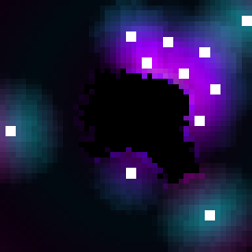

# Voidvasion

## Description

In this game, you place orbs to delay the void. Your core orb will eventually break. By strategically placing orbs, you can survive longer. After the game finishes, you receive a result depending on the time you stayed in the game. A game takes around 2 minutes. How long can you survive?

You can play the game [here](https://arytherias.itch.io/voidvasion).

This game was made in about 2 weeks for [LOWREZJAM 2023](https://itch.io/jam/lowrezjam-2023).

## Game rules and controls

Use your mouse to place orbs. Press "START" when you are finished.
You can also place orbs after pressing "START" but you cannot have more than 15 orbs at a time.

The game is over when one of your core orbs (initial orbs) breaks.

## Tactical tips

* Orbs slow down the void significantly. Place your orbs in a way such that the void cannot reach your core easily.
* When orbs break, you can place new orbs. Try placing your orbs close to the void so that they break sooner.
* Try to predict which orb will break next so you can already think of a spot for your next orb.
* If many orbs break at the same time, you will have a very stressful time to place new orbs.

## Credits

Game by [Arytherias](https://arytherias.itch.io/) and [greenp42](https://github.com/greenp42).

This game is developed with [Godot game engine](https://godotengine.org/).
(see also https://godotengine.org/license)

The used font is Silkscreen from [The Silkscreen Project Authors](https://github.com/googlefonts/silkscreen).

All Soundeffects are from [Freesound](https://freesound.org/):

* game
  * [button2.mp3](https://freesound.org/people/Camouflaged_Noob/sounds/483709/) by [Camouflaged_Noob](https://freesound.org/people/Camouflaged_Noob/) | Creative Commons 0
  * [Teleport-01b.wav](https://freesound.org/people/DWOBoyle/sounds/474179/) by [DWOBoyle](https://freesound.org/people/DWOBoyle/) | Attribution 3.0
  * [Dark Magic Loop](https://freesound.org/people/qubodup/sounds/442825/) by [qubodup](https://freesound.org/people/qubodup/) | Creative Commons 0
  * [Glass Break](https://freesound.org/people/unfa/sounds/221528/) by [unfa](https://freesound.org/people/unfa/) | Creative Commons 0
  * [Landing Forcefield](https://freesound.org/people/unfa/sounds/584173/) by [unfa](https://freesound.org/people/unfa/) | Creative Commons 0
* user interface
  * [button](https://freesound.org/people/Leszek_Szary/sounds/146717/) by [Leszek_Szary](https://freesound.org/people/Leszek_Szary/) | Creative Commons 0
  * [menu button](https://freesound.org/people/Leszek_Szary/sounds/191592/) by [Leszek_Szary](https://freesound.org/people/Leszek_Szary/) | Creative Commons 0
